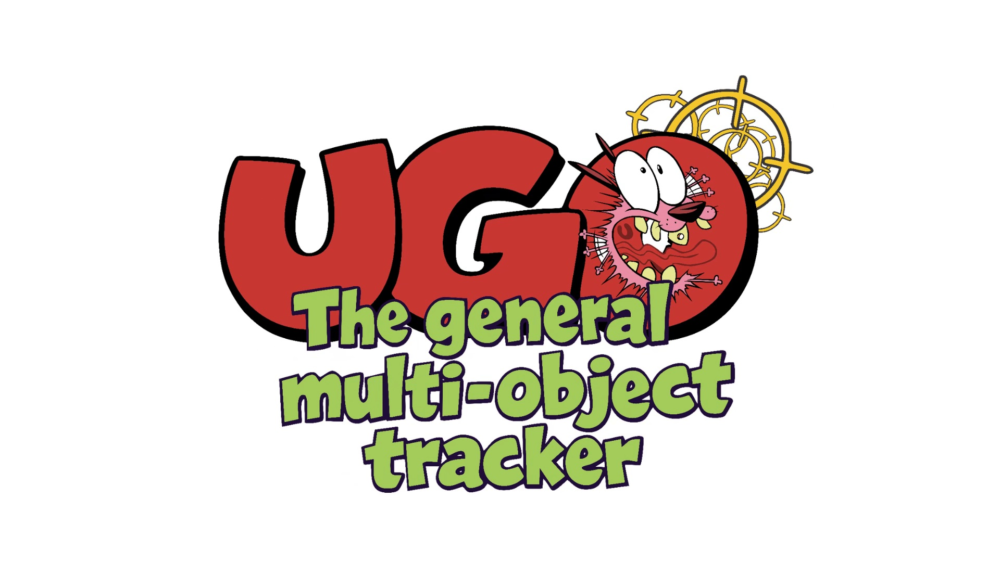
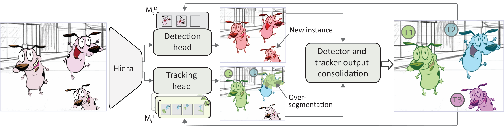

# UGO: Unified Architecture for General Multi-Object Tracking by Segmentation

**Accepted to NeurIPS 2026**

https://arxiv.org/pdf/2609.37339

**Code coming soon.**

  

https://github.com/user-attachments/assets/e6891108-3ee1-4f28-8367-7a91f5b2c43e

## Highlights

- **Unified detection and tracking.** A shared Hiera backbone combines GECO2-based instance localization with SAM2 frame-to-frame propagation, producing compatible pixel-wise outputs from visual exemplars.
- **Training-free consolidation.** Energy minimization resolves overlaps, duplicates, and detector–tracker conflicts into mutually exclusive instance masks while suppressing poorly supported hypotheses.
- **Hierarchical adaptive memory.** Category-level memory adapts the detector's visual exemplars from reliable tracks, while recent-appearance and distractor-resolving memories improve instance segmentation and identity preservation.
- **Reliable track management.** Consolidated detections initialize tracks, corrected masks update their memories, and detector confirmation validates trajectories while collapsed tracks terminate cleanly.

## Architecture

  

